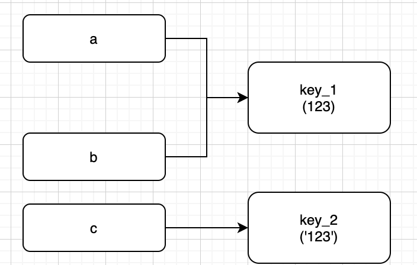
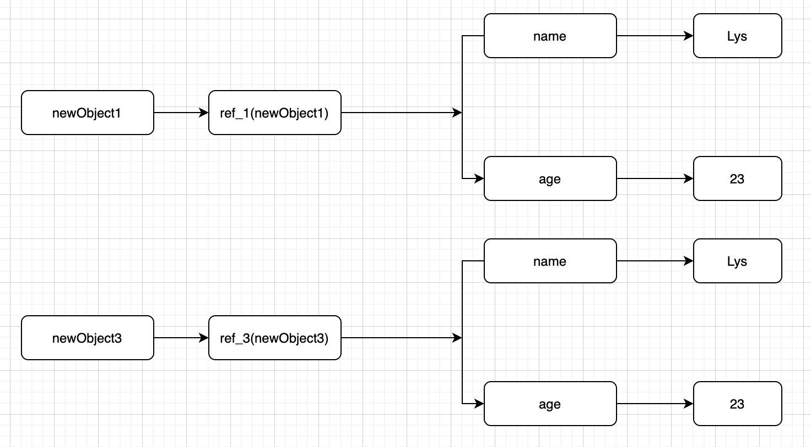
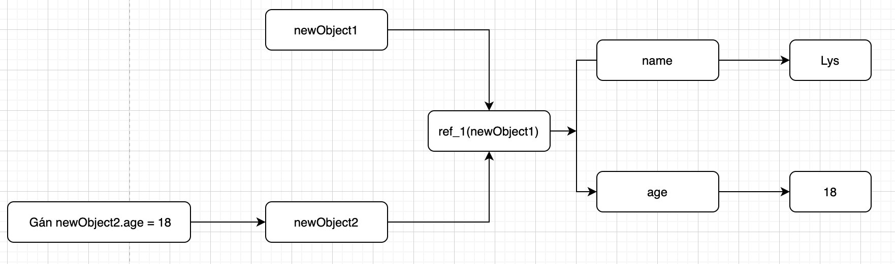
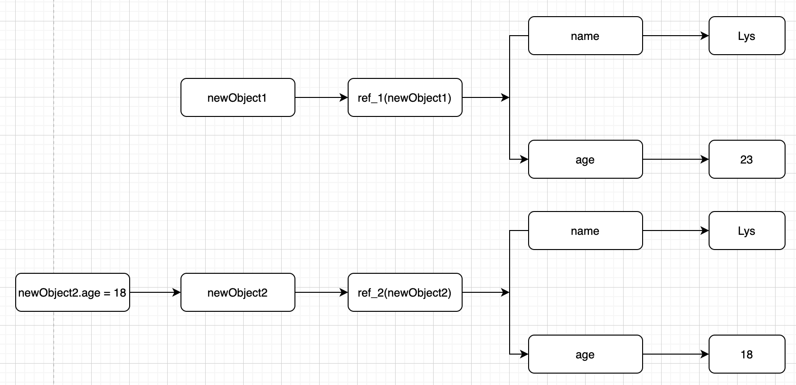

# Mutable và Immuatable trong Javascript

- Trong bài viết này chúng ta cùng nhau tìm hiểu về 2 khái niệm Mutable và Immutable khác nhau như thế nào?

## Immuatable là gì?

- Immuatable là một kiểu biến không làm thay đổi được giá trị.
- vd: khi chúng ta muốn khai báo 1 biến với 1 giá trị là `'b'` không bị thay đổi thì chúng ta sẽ khai báo như sau:
  
  ```
    let a = 'b'
    a = 'c'
    // theo bạn khi mình khai báo biến a như thế này thì nó có bị thay đổi giá trị không???
  ```

  - Câu trả lời là `Có`. Bởi vì `a` được khai báo với `let` vì đặc tính của `let` được phép gán giá trị mới. Nhưng nó không cho bạn khai báo lại với biến giống như vậy. Vậy làm sao để chúng ta khai báo 1 biến có giá trị là `'b'` mà không bị thay đổi thành `'c'`, bạn hãy xem ví dụ dưới đây nhé:

  ```
    const a = 'b'
    a = 'c' // Uncaught TypeError: Assignment to constant variable.
  ```

  - Như ví dụ trên thì chúng ta đã thấy là khi khai báo `const` mà chúng ta thay đổi giá trị của `a` thì sẽ bị báo lỗi. Bởi vì `const` là hằng số mà hằng số thì không thể thay đổi được, nhưng nó chỉ đối với các giá trị kiểu `Primitive (nguyên thuỷ)` mà thôi.
  - Vậy còn `Object` và `Array` thì sao??? nếu các bạn muốn biết thì hãy tiếp tục đọc phần dưới nhé....


## Mutable là gì?

- Mutable là một kiểu biến có thể làm thay đổi được giá trị.
- vd: khi chúng ta khai báo 1 biến với giá trị là `object` và chúng ta thay đổi giá trị trong đó thì nó có bị thay đổi không? các bạn đoán thử xem...
  
  ```
    const newObject = { 
        name: 'Lys',
        age: '23'
    }
    1. newObject.age = '18'
    2. newObject = { 
        name: 'Lys',
        age: '23'
    }

    // theo bạn 2 trường hợp đó nó có đúng hay không ???? 
  ```

- Câu trả lời là 1 đúng và 2 không đúng. Vậy tại sao 1 lại đúng mà 2 lại không đúng???
- khi bạn khai báo 1 biến với kiểu giá trị là `object` hoặc `array` thì bạn có thể thay đổi các thuộc tính của nó. Nên trường hợp 1 đúng vì nó làm thay đổi thuộc tính chứ không phải giá trị của biến và trường hợp 2 không đúng vì nó gán với 1 giá trị mới.


## Nếu chúng ta so sánh các biến có giá trị giống nhau thì như thế nào???

- **Primitive Value:**
  
  ```
    const a = 123;
    const b = 123;
    const c = '123'

    1. a == b
    2. a == c
    3. a === c

    theo bạn 1, 2, 3 thì trường hợp nào là true hoặc false. 
  ```

    A: Câu trả lời là 1, 2 `true` và 3 `false`.

  ```
    const a = 123;
    const b = 123;
    const c = '123'

    1. a == b // 123 == 123 => true
    2. a == c // 123 == '123' => vì == nó sẽ thực hiện chuyển đổi kiểu giống nhau trước khi so sánh => true
    3. a === c // 123 === '123' => vì === nó không thực hiện chuyển đổi kiểu => false
  ```

  

  * lưu ý: tất cả các kiểu giá trị nguyên thuỷ khi được khai báo có giá trị giống nhau và kiểu giống nhau đều nằm cùng 1 địa chỉ ô nhớ.

- **Object Value**

  ```
    const newObject1 = { name: 'Lys', age: '23' }
    const newObject2 = newObject1
    const newObject3 = { name: 'Lys', age: '23' }

    1. newObject1 === newObject2 // ???
    2. newObject1 === newObject3 // ???

    Theo các bạn thì 2 trường hợp này là true hay false.
  ```

  A: Câu trả lời là 1 `true`, 2 `false`.

  Q: Vì sao lại là trường hợp 2 lại false nhỉ, trong khi nó đều là `object`  giống nhau giá trị bên trong cũng giống nhau sao lại là `false` nhỉ, Lạ ghê :(((.

  - Trường hợp 1 là `true` bởi vì giá trị của chúng nằm cùng 1 địa chỉ ô nhớ => `true`.

  

  - Trường hợp 2 là `false` bởi vì giá trị của chúng nằm khác địa chỉ ô nhớ => `false`

  


  - Nếu chúng ta thay đổi thuộc tính của `newObject2` thì `newObject1` sẽ như thế nào?
  ```
    const newObject1 = { name: 'Lys', age: '23' }
    const newObject2 = newObject1
    newObject2.age = 18;
    console.log(newObject1.age) //  ???
  ```

  

  - như bạn đã thấy trên hình thì `age`  trong `newObject1` sẽ có giá trị là `18`.

  - Vậy nếu như chúng ta muốn lấy tất cả thuộc tính của `newObject1` mà không làm ảnh hưởng đến `newObject1` thì chúng ta làm như sau:

  ```
    const newObject1 = { name: 'Lys', age: '23' }
    const newObject2 = { ...newObject1 }
    newObject2.age = 18;
    console.log(newObject1.age) // 23
  ```

  

## Nguồn tham khảo

- https://developer.mozilla.org/en-US/docs/Glossary/Mutable.
- https://developer.mozilla.org/en-US/docs/Glossary/Immutable

## Tóm lại

- Biến có giá trị là nguyên thuỷ -> immutable.
- Biến có giá trị là Object hoặc Array -> mutable.